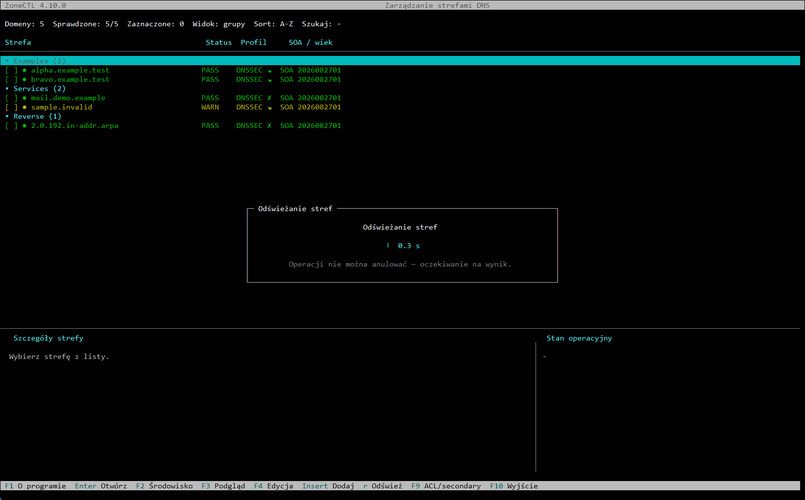
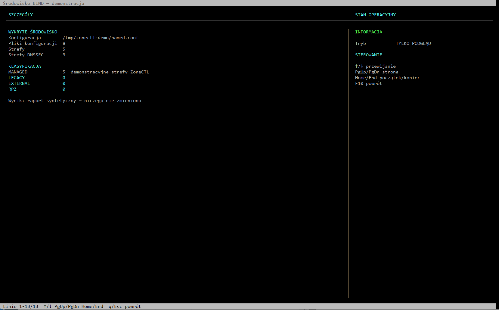
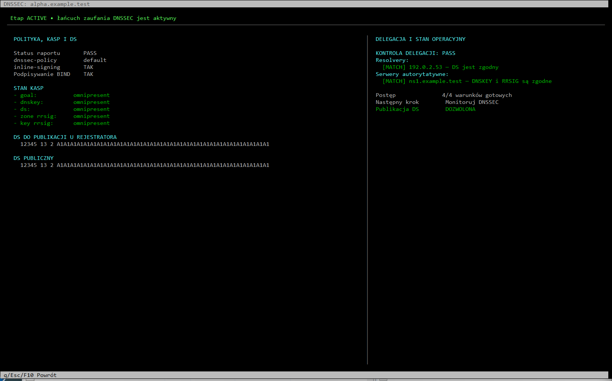
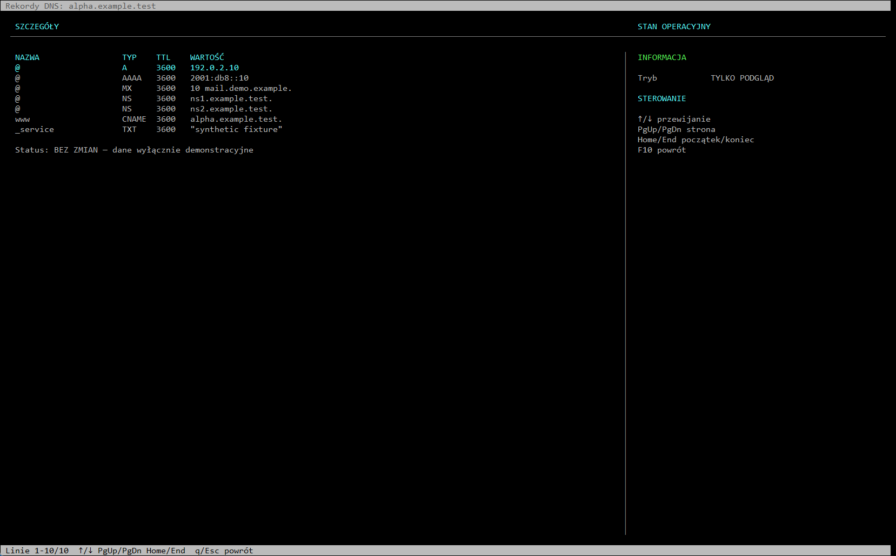
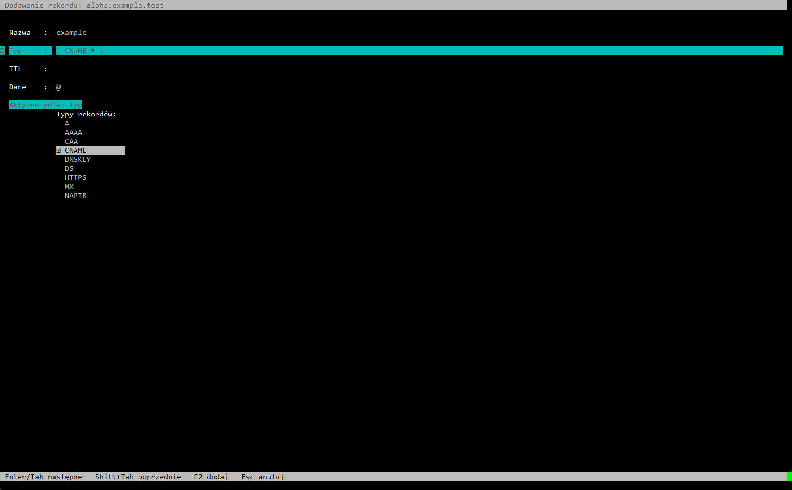
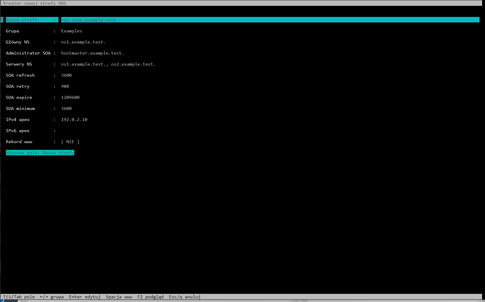
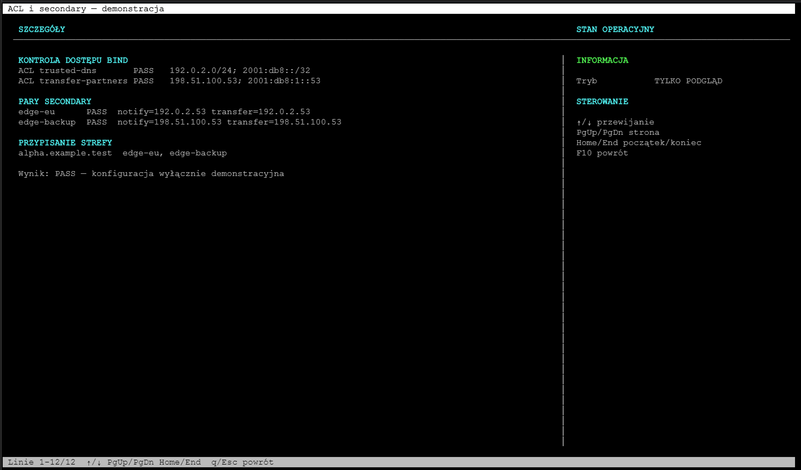
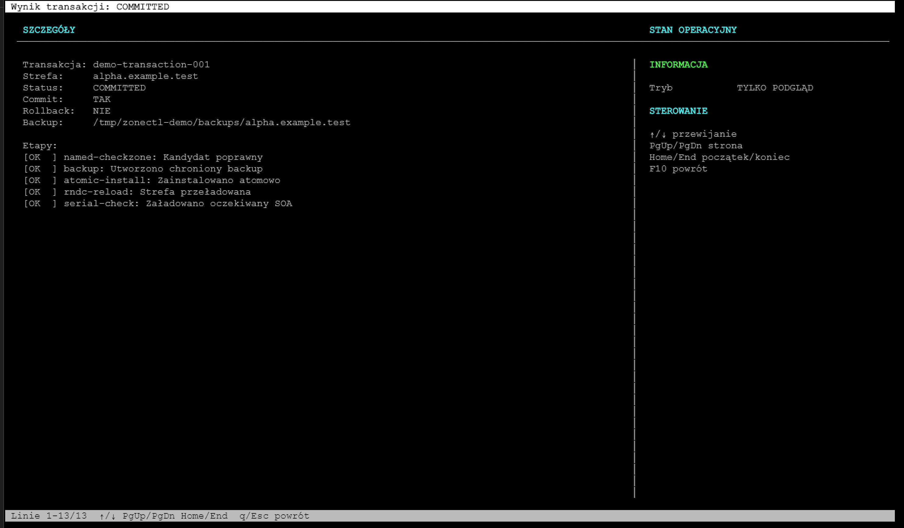
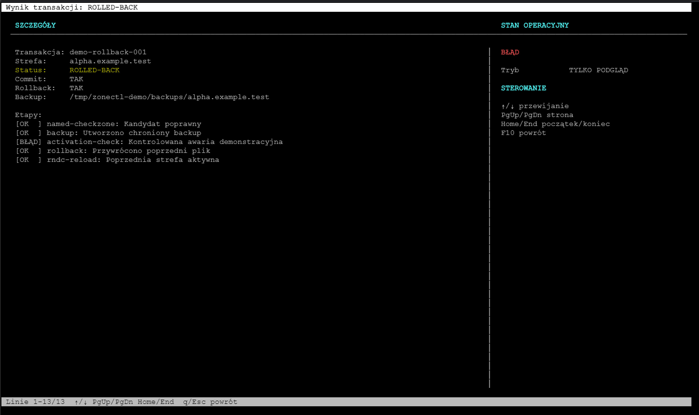
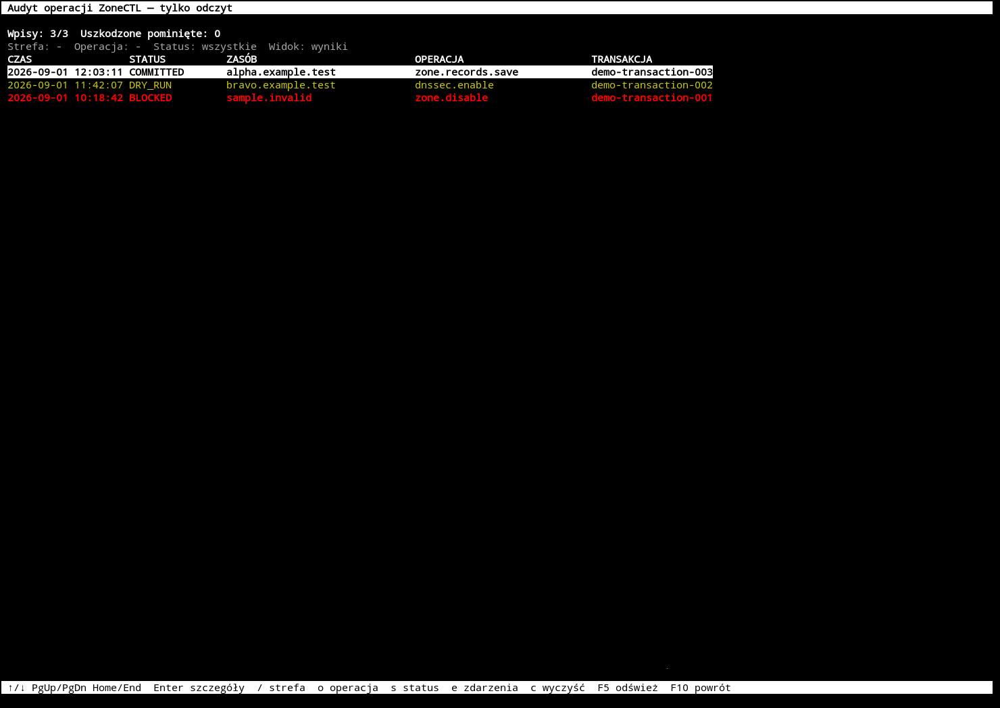

# Safe screenshot specification

This document defines how public ZoneCTL screenshots must be produced. An
isolated main-screen renderer and the first gallery were released in 4.10.1.

## Mandatory isolation

Screenshot generation must not read production BIND configuration, zone
files, KASP state, environment-specific paths, the system hostname or operator
identity. It must run from deterministic fixtures in a temporary directory.

## Allowed example data

- zones: `example.test`, `demo.example`, `sample.invalid`;
- name servers: `ns1.example.test`, `ns2.example.test`;
- IPv4: `192.0.2.0/24`, `198.51.100.0/24`, `203.0.113.0/24`;
- IPv6: `2001:db8::/32`;
- documentation-only DNSSEC keys and DS values generated from fixtures;
- generic operator name `demo-operator`;
- temporary paths below `/tmp/zonectl-demo`.

No real domain, server name, public address, email address, username, key,
token, transaction identifier or production filesystem path may appear.

## Isolated renderer

Run the first documentation view from the repository root:

```console
PYTHONPATH=src .venv/bin/python scripts/run_screenshot_demo.py
```

On a headless documentation host with Xvfb, xterm, xdotool and ImageMagick,
the audit view can be captured deterministically and stripped of metadata:

```console
sh scripts/capture_screenshot_demo.sh u docs/images/tui-audit-browser.png
```

The demo imports the production renderers but replaces BIND checks with
deterministic in-memory results. Available keys are:

- `r` — repeat the synthetic refresh and capture the wait dialog;
- `a` — open the production add-record form with synthetic zone context;
- `z` — open the production new-zone wizard with synthetic defaults;
- `b` — show the isolated BIND environment summary;
- `d` — show the production DNSSEC 4.10 layout with a fictional DS;
- `l` — show a synthetic DNS record list;
- `c` — show synthetic ACLs, secondary pairs and a zone assignment;
- `t` — show a successful synthetic transaction in the production renderer;
- `x` — show a controlled failure followed by a successful rollback;
- `u` — open the read-only audit browser with synthetic operation history;
- `q`, `Esc` or `F10` — exit the current view or the demo.

## Published gallery

The images below were captured from the isolated renderer. They contain only
reserved example domains, documentation address ranges and a fictional DS.

### Responsive wait dialog



### BIND environment summary



### DNSSEC operational status



### DNS record list



### Adding a record



### Creating a zone



### ACL and secondary configuration



### Successful transaction



### Completed rollback



### Audit browser



## Future additions

| File | View | Required content |
|---|---|---|
| `tui-main.png` | main zone list | mixed PASS/WARN states and example zones |
| `records-editor.png` | record editor | synthetic A, AAAA, MX, TXT and CAA records |
| `dnssec-status.png` | DNSSEC workflow | safe propagation stage and fictional DS |

## Presentation rules

- use one stable terminal size and font;
- retain the actual ZoneCTL color palette and key labels;
- do not manually redraw behavior that differs from the application;
- strip PNG metadata before committing;
- provide meaningful English alt text in `README.md` and Polish alt text in
  `README.pl.md`;
- regenerate images through a documented command rather than editing them by
  hand.

## Release gate

Before publication, scan source fixtures, rendered text and PNG metadata for
known production identifiers. Review every image at full resolution. A failed
privacy scan or visual review blocks the screenshot commit and the release.
